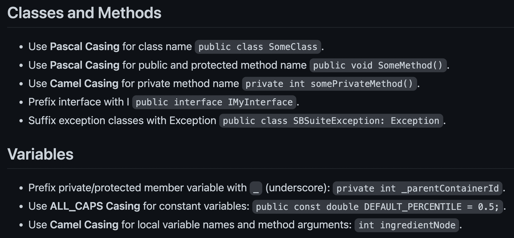

```{r setup, include=FALSE}
options(htmltools.dir.version = FALSE)

knitr::opts_chunk$set(eval = FALSE)
```

layout: false

class: inverse, center, middle

## "There are only two hard things in Computer Science: </br>cache invalidation and naming things."</br>
### - Phil Karlton

---

layout: false

class: inverse, center, middle

## The following advice on naming applies to all kinds of programming entities (variables, functions, packages, classes, etc.) and is language-agnostic.

---

### Principle: **Names are a form of abstraction**

> "[T]he best names are those that focus attention on what is most important about the underlying entity while omitting details that are less important."
> 
> \- Jonh Ousterhout

--

### Importance: **Names are at the core of software design** 

If you can't find a name that provides the right abstraction for the underlying object, it is possible that the underlying object doesn't have a clear design.

--

### Properties: **Good names are precise and consistent**

If a name is good, it is difficult to miss out on critical information about the object or to misinterpret the underlying representation.

---

layout: false

class: inverse, center, middle

# "The beginning of wisdom is to call things by their proper name."</br>
## - Confucius

---

## Good names are a form of documentation.

How good a name is can be assessed by how detailed the accompanying comments need to be.

--

For example, this has neither good function nor parameter name, and you can tell that from how much work the comments are doing:

```{Rcpp}
// function to convert temperature from Fahrenheit to Celsius scale
// temp is the temperature in Fahrenheit
double unitCoverter(double temp)
```

--

Contrast it with:

```{Rcpp}
double fahrenheitToCelsius(double tempFahrenheit)
```

We didn't even need a comment here!

--

.content-box-blue[
**Good names rarely require readers to read the documentation to understand what they represent.**
]

---

## Generic names should be avoided.

Generic names don't provide much information about the values or the purpose of the entity they represent.

--

For example, 

.pull-left[
```{r}
# generic
count 
distance()
size
```
]

.pull-right[
```{r}
# more informative
character_count 
euclidean_distance()
memoryBytes
```
]

--

.content-box-blue[
**Generic names compromise code readability because they provide little information.**
]

---

## Conventions should be followed for generic names.

Sometimes using generic names can improve code readability. But, in such cases, it is **vital** to follow language or domain customs.

--

For example, using `j` for outermost and `i` for nested loop is confusing!.

```{js}
  for (let j = 0; j < arr.length; j++) {
    for (let i = 0; i < arr[j].length; i++) {
```

In a similar vein,

- `tmp` shouldn't be used to store objects that are not temporary
- `retVal` shouldn't be used for objects not returned from function
- etc.

--

.content-box-blue[
**Don't violate reader assumptions about what generic names represent.**
]

---

## But, seriously, avoid generic names.

If a loop is longer than a few lines, use more meaningful loop variable names than `i`, `j`, `k` because you will quickly lose track of what refers to what.

.pull-left[
```{r}
# abstruse
exam_score[i][j]
```

]

.pull-right[
```{r}
# crystal clear
exam_score[school][student]
```

]

--

All variables are temporary in some sense. Calling one `tmp` is inviting developers to treat it carelessly and introduce bugs.

.pull-left[
```{r}
# generic name
if (right < left) {
  tmp   <- right
  right <- left
  left  <- tmp
}
```
]

.pull-right[
```{r}
# more descriptive
if (right < left) {
 old_right <- right
 right     <- left
 left      <- old_right
}
```
]

.content-box-blue[
**Even when you *think* you need generic names, you are better off using descriptive names.**
]

---

## Names should be consistent.

Consistent names **reduce cognitive burden** on the readers because if they encounter a name in one context, they can safely reuse that knowledge in another context.

--

For example, these names are inconsistent since the reader can't safely assume the name `size` means the same thing throughout the program.

```{c}
// context-1: `size` stands for number of memory bytes
{
  size = sizeof(x);
}

// context-2: `size` stands for number of elements
{
  size = strlen(a);
}
```

--

.content-box-blue[
**Allow users to make safe assumptions about what the names represent across different scopes/contexts.**
]

---

### Unnecessary words from names should be removed...

.pull-left[
```{r}
# okay 
convert_to_string()
createPlotHistogram()
fileObject
strName # Hungarian notation
```
]

.pull-right[

```{r}
# better 
to_string()
plotHistogram()
file
name
```

]

</br>

--

### but important details should be kept!

.pull-left[

```{r}
# okay 
child_height
password
id
address
```

]

.pull-right[

```{r}
# better 
child_height_cm
plaintext_password
hex_id
ip_address
```

]

.content-box-blue[
**If some information is critical to know, it should be part of the name.**
]

---

## Names should be precise but not *too* long.

How precise (and thus long) the name should be is a **subjective decision**, but keep in mind that long names can obscure visual structure of a program.

--

You can typically find a middle ground between too short and too long names.

```{r}
# not ideal - too imprecise
d
# okay - can use more precision
days 

# good - middle ground
days_since_last_accident 

# not ideal - unnecessarily precise
days_since_last_accident_floor_4_lab_23 

...
```

--

.content-box-blue[
**Don't go too far with making names precise.**
]

---

## Names should be difficult to misinterpret.

Try your best to misinterpret candidate names and see if you succeed.

--

Example: Here is a GUI text editor class method to get position of a character

```{Rcpp}
std::tuple<int, int> getCharPosition(int x, int y)
```

--

How I interpret the parameters `x` and `y`: 

> "`x` and `y` refer to pixel positions for a character."

--

How they are meant to be interpreted:

> "`x` and `y` refer to line of text and character position in that line."

--

You can avoid such misinterpretation with better names:

```{Rcpp}
std::tuple<int, int> getCharPosition(int lineIndex, int charIndex)
```

--

.content-box-blue[
**Making names as precise and unambiguous as possible leaves little room for misconstrual.**
]

---

## Names should be easily searchable.

While naming things, always ask yourself how easy it would be to replace the chosen name with a different name in the future.

--

For example, this plotting function uses identifier `p` to represent plot.

```{r}
plotScatter <- function() {
  p <- ggplot(mtcars, aes(wt, mpg)) + geom_point()
  p <- p + labs(title = "my first scatter plot")
  p
}
```

In future, it won't be easy either to search for and/or to rename it in the codebase.

Instead, if you use `scatter_plot`, both search and replace operations will be a piece of cake.

--

.content-box-blue[
**Choose names that can be searched and, if the need arises, replaced.**
]

---

## Names should honor the culture.

The names should respect the conventions adopted in a given programming language, domain of knowledge, project, organization, etc.

--

For example, C++ convention is to use PascalCase for class names and lowerCamel case for variables. 

.pull-left[
```{Rcpp}
// non-conventional
class playerEntity
{
public:
    std::string HairColor;
};
```
]

.pull-right[
```{Rcpp}
// conventional
class PlayerEntity
{
public:
    std::string hairColor;
};
```
]

--

.content-box-blue[
**Don't break conventions unless other guidelines require overriding them for consistency.**
]

---

## Name Booleans with extra care.

Names for Boolean variables or functions should make clear what true and false means. This can be done using prefixes (**is**, **has**, **can**, etc.).

.pull-left[

```{r}
# not great
if (child) {
  if (parentSupervision) {
    watchHorrorMovie <- TRUE
  }
}
```

]

.pull-right[

```{r}
# better
if (isChild) {
  if (hasParentSupervision) {
    canWatchHorrorMovie <- TRUE
  }
}
```

]

--

Use positive terms for Booleans since they are easier to process.

.pull-left[

```{r}
# double negation - difficult
disable_firewall = FALSE
```

]

.pull-right[

```{r}
# better
enable_firewall = TRUE
```

]

--

.content-box-blue[
Give Boolean variable names that convey what true or false implies.
]

---

## Formatting names can provide additional information.

Having different name formats for different entities makes the code easier to read because it **acts like syntax highlighting**.

--

For example, here is an example of formatting conventions (adopted in [OSP organization](https://github.com/Open-Systems-Pharmacology/Suite/blob/develop/CODING_STANDARDS.md)):

```{r, echo=FALSE, eval=TRUE}

```


---

## Names should be kept up-to-date.

To resist software entropy, not only should you name entities properly, but you should also rename them to keep up with the new developments.

Otherwise, names will become something worse than meaningless or confusing: **misleading**.

--

For example, let's say your class has `$getMeans()` method. 

- In its initial implementation, it used to return *precomputed* mean values. 
- In its current implementation, it *computes* the mean values on the fly. 

Therefore, it is misleading to continue to call it a getter method, and it should be renamed to `$computeMeans()`.

--

.content-box-blue[
**Keep an eye out for API changes that make names in your codebase misleading.**
]

---

## Names should be pronounceable.

This is probably the weakest of the requirements, but one can't deny the ease of communication when names are pronounceable.

--

If you are writing a function to generate a time-stamp, discussing the following function verbally would be challenging.

```{r}
# generate year month date hour minute second
genymdhms()
```

This is a much better (and pronounceable) alternative:

```{r}
generateTimeStamp()
```

---

# Use consistent lexicon in a project.

Once you settle down on a mapping from an abstraction to a name, use it consistently *throughout the codebase*.

--

E.g., two similar methods here have different names across `R6` classes:

```{Rcpp}
CreditCardAccount$new()$retrieve_expenditure()
DebitCardAccount$new()$fetch_expenditure()
```

Both of these methods should either be named `$retrieve_expenditure()` or `$fetch_expenditure()`.

--

.content-box-blue[
**Consistency of naming conventions should be respected at the codebase level, not just for short scopes.**
]

---

# A sundry of don'ts

--

- **Don't use pop-culture references in names.** Not everyone can be expected to be familiar with them. E.g. `female_birdsong_recording` is a better variable name than `thats_what_she_said`.

--

- **Don't use slang.** You can't assume current or future developers to be familiar with them. E.g. `exit()` is better than `hit_the_road()`.

--

- **Avoid unintended meanings.** Do your due diligence to check dictionaries (especially Urban dictionary!) if the word has unintended meaning. E.g. `cumulative_sum()` is a better function name than [`cumsum()`](https://rdrr.io/r/base/cumsum.html).

--

- **Avoid imprecise opposites**, since they can be confusing. E.g. parameter combination `begin`/`last` is worse than either `begin`/`end` or `first`/`last`.

--

- **Don't use inconsistent abbreviations.** E.g. instead of using `numColumns` (*number* of columns) in one function and `noRows` (*number* of rows) in another, choose one and use it consistently.

---

layout: false

class: inverse, center, middle

# Case studies

### Looking at names in the wild that violate presented guidelines.

This is **not** to be taken as criticisms but as real-life learning opportunities to drive home the importance of these guidelines.

---

## Violation: Breaking (domain) conventions

R is a programming language for statistical computing, and function names can be expected to respect the domain conventions.

--

Statistical distributions can be characterized by centrality measures, like mean, median, mode, etc., and R has functions with names that wouldn't surprise you, except one:

```{r}
x <- c(1, 2, 3, 4)
mean(x)   # works
median(x) # works
mode(x)   # error! 
```

The `mode()` function actually returns the storage mode of an R object!

--

This function could have been named (e.g.) `storageMode()`, which is more precise and doesn't break domain-specific conventions.

---

## Violation: Generic name

The parameter `N` in `std::array` [definition]((https://en.cppreference.com/w/cpp/container/array) is too generic.

```{Rcpp}
template<
    class T,
    std::size_t N 
> struct array;
```

`size` is a bit better but still leaves room for misunderstanding: 
> "Does it mean length or memory bytes?"

--

Here is an alternative name:

```{Rcpp}
template<
    class T,
    std::size_t numberOfElements
> struct array;
```

`numberOfElements` is more precise and unmistakable

---

layout: false

class: inverse, center, middle

## Violation: Inconsistency in naming schema

*ggplot2* is a [plotting framework](https://ggplot2.tidyverse.org/) in R. 

Quite admirably, it accepts both **British** and **American** English spellings. 

But does it do so *consistently*?

---

## Function names

Both forms of spellings are supported.

```{r}
# works
guide_colorbar(...)

# this works as well
guide_colourbar(...)
```

--

## Function parameters

Both forms of spellings are supported.

```{r}
# works
aes(color = my_variable)

# this works as well!
aes(colour = my_variable)
```

---

## Function names *and* parameters 

A user has now come to believe that *ggplot2* supports British and American spellings for both function names *and* parameters.

And, since they prefer American spellings, they do this:

```{r}
guide_colorbar(ticks.color = "black")
```

--

**That won't work!**

Both functions support **only** the British spelling of parameters:

```{r}
guide_colourbar(ticks.colour = "black")
guide_colorbar(ticks.colour = "black")
```

--

This is **inconsistent** and **violates user's mental model** about function and parameter naming schema<sup>*</sup>.

.footnote[

*This can be a painful source of bugs because the function will fail silently.

]

---

## Violation: Room for misunderstanding

In Python, [`filter()`](https://www.w3schools.com/python/ref_func_filter.asp) can be used to apply a function to an iterable.

```{python}
list(filter(lambda x: x > 0, [-1, 1]))
```

--

But `filter` is an ambiguous word:

- It could mean to pick out elements that pass a condition (what *remains after filtering*), or
- it could mean to pick out elements that need to be removed (what *is filtered*). 

Imagine you've never used this function before. Can you predict if it will return `1` or `-1`?

--

It returns `1`, so the intent is to pick out the elements that pass the condition. </br>
In this case, **`keep()`** would've be a better name.

Had the intent been to find elements to remove, **`discard()`** would've be a better name.

---

layout: false

class: inverse, center, middle

# etc.

### It is easy to find such violations, but, whenever you encounter one, make it a personal exercise to come up with a better name.

---

layout: false

class: inverse, center, middle

# Challenges

---

## Worth the struggle

--

Initially, you may struggle to find good names and settle down for the first serviceable name that pops into your head.

**Resist the urge!**

--

Adopt an investment mindset and remember that the little extra time invested in finding good names early on will pay dividends in the long run by reducing accumulation of complexity in the system.

--

**The more you do it, the easier it will get!**

And, after a while, you won't even need to think long and hard to come up with a good name. You will instinctively think of one!

---

layout: false

class: inverse, center, middle

# Benefits of naming things well

---

## "What's in a name?" Well, everthing!

--

- Intent-revealing names make the **code easier to read**.

--

- Trying to find good names forces you to detach from the problem-solving mindset and to **focus on the bigger picture** that motivates this change. This is critical for thoughtful software design.

--

- Searching for precise names requires clarity, and seeking such clarity **improves your own understanding** of the code.

--

- Naming precisely and consistently **reduce ambiguities and misunderstandings**, which reduce the possibility of bugs.

--

- Good names **reduce the need for documentation**.

--

- Consistent names **reduce cognitive overload** for the developers and make the code more readable and maintainable.

--

- etc.

---

# Further Reading

For a more detailed discussion about how to name things, check out following references. 
The **page numbers** in parentheses point to relevant sections/chapters.

- McConnell, S. (2004). *Code Complete*. Microsoft Press. (**pp. 259-290**)

- Boswell, D., & Foucher, T. (2011). *The Art of Readable Code*. O'Reilly Media, Inc. (**pp. 7-31**)

- Ousterhout, J. K. (2018). *A Philosophy of Software Design*. Palo Alto: Yaknyam Press. (**pp. 121-129**)

- Martin, R. C. (2009). *Clean Code*. Pearson Education.(**pp. 17-30**)

- Thomas, D., & Hunt, A. (2019). *The Pragmatic Programmer*. Addison-Wesley Professional. (**pp. 238-242**)

For a good example of organizational naming guidelines, see:

- [Google C++ Style Guide](https://google.github.io/styleguide/cppguide.html#Naming)

---

layout: false

class: inverse, center, middle

# Find me on...

.font100[

🐦 [Twitter](http://twitter.com/patilindrajeets)

💼 [LinkedIn](https://www.linkedin.com/in/indrajeet-patil-397865174/)

💻 [GitHub](mailto:patilindrajeet.science@gmail.com)

]

---

layout: false

class: inverse, center, middle

## Source code for these slides is available [here](https://github.com/IndrajeetPatil/second-hardest-cs-thing/).

If you have any feedback on these slides, please create issue there.

---

layout: false

class: inverse, center, middle

# The End 👋
